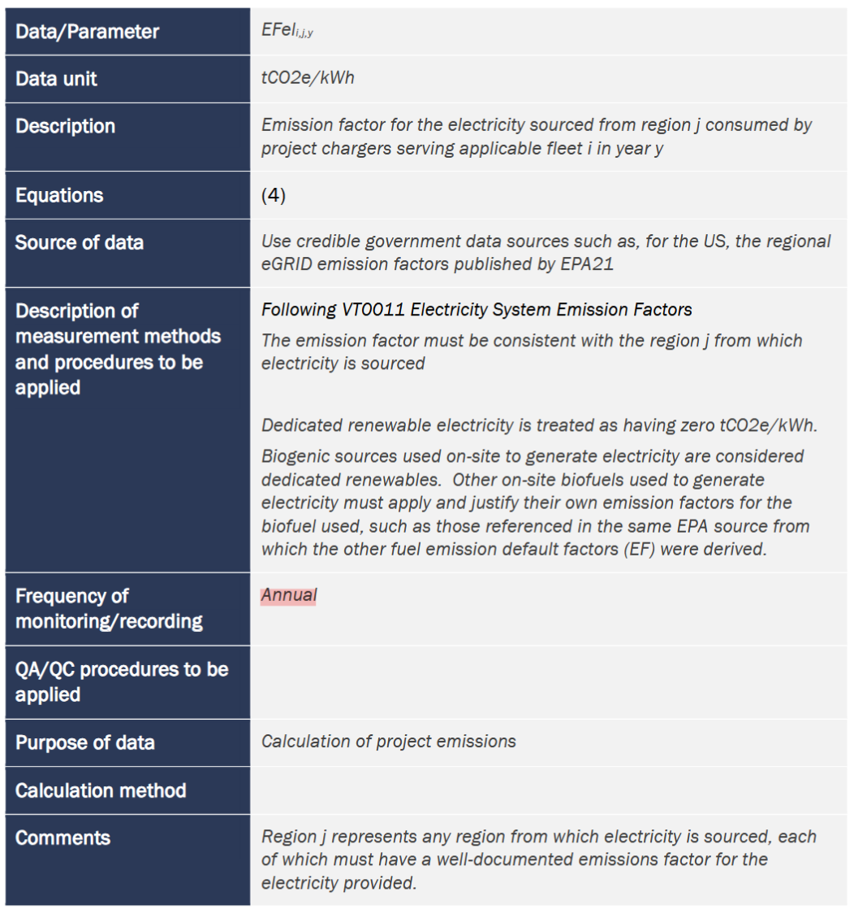
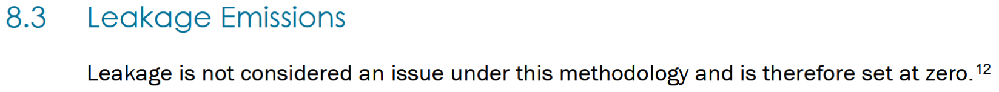
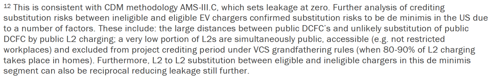

# Critique of Verra VM0038

---

## 减排量量化方法：**净减排量 = (基线排放 - 项目排放) × 折扣因子**

### 1. 基线排放 (Baseline Emissions)

### 2. 电动汽车加权平均电耗 (Weighted Average EV Electricity Consumption)

### 3. 对标燃油车加权平均油耗 (Weighted Average Fossil Fuel MPG)

### 4. 基础项目排放 (Basic Project Emissions)

### 5. 含配套基础设施的项目排放 (Project Emissions with Associated Infrastructure)

### 6. 现场储能电池排放因子 (On-site Battery Emission Factor)

### 7. 最终净减排量 (Net GHG Emission Reductions)

### 参数说明表：

- ：适用车队类别 (Applicable Fleet class)
- ：电力来源区域 (Region)
- ：项目核算年度 (Project Year)
- ：配套基础设施来源 (Associated Infrastructure Source，如电网、光伏、电池)
- ：特定的电动汽车车型 (EV Model)
- ：对应的化石燃料类型 (Fossil Fuel type)
- ：第  核算年度的**基准排放量**（单位：）
- ：第  核算年度，由项目充电系统向适用车队  **输送的电量**（单位：）
- ：第  核算年度，对标车队  所使用的化石燃料  的**排放因子**（单位：）
- ：适用车队  的**技术改进率因子**（用于修正未来燃油车能效提升对基准线的影响）
- ：第  核算年度，适用车队  中电动汽车的**加权平均单位里程电耗额定值**（单位：）
- ：第  核算年度，与适用车队  对标的化石燃料车辆的**加权平均燃油效率额定值**（单位：）
- ：第  核算年度，适用车队  中车型  的电动汽车**单位里程电耗额定值**（单位：）
- ：第  核算年度，与适用车队  中车型  的电动汽车相对标的化石燃料车型的**燃油效率额定值**（单位：）
- ：截至第  核算年度，适用车队  中车型  的电动汽车**累计保有量**（用于加权计算）
- ：第  核算年度的**项目排放量**（单位：）
- ：第  核算年度，区域  内服务于适用车队  的项目充电桩所**消耗的电量**（单位：）
- ：第  核算年度，区域  内服务于适用车队  的项目充电系统所消耗电力的**排放因子**（单位：）
- ：第  核算年度，区域  内服务于适用车队  的充电系统从配套基础设施来源  消耗的**净电量**（已扣除回馈电量，单位：）
- ：第  核算年度，区域  内服务于适用车队  的充电系统从各配套基础设施来源  消耗电力的**排放因子**（单位：）
- ：第  核算年度，区域  内服务于适用车队  的现场储能电池向电网或建筑提供的电量（即未用于充电的**逃逸/转移电量**，单位：）
- ：第  核算年度，区域  内服务于适用车队  的充电系统从**现场储能电池**配套基础设施消耗电力的排放因子（单位：）
- ：第  核算年度，区域  内服务于适用车队  的现场储能电池从配套基础设施来源 （仅含电网及专用可再生能源）**消耗的电量**（单位：）
- ：第  核算年度的**温室气体净减排量**（单位：）
- ：第  核算年度适用的**折扣因子**（调减系数），用于校准权属并防止重复计算（单位：%）

***

## 1. 物理边界的缺失：从建材隐含碳到高频维保 

**A 阶段 (CapEx)**：充电桩制造（特别是大功率直流快充 DCFC 包含的大量铜、铝、电力电子模块）、土建施工、变压器等前端隐含碳被默认归零。

> 项目边界除了替代的燃油消耗外，只包含了运营期间充电基础设施的电力消耗。忽视充电桩的隐含碳会导致签发的 VCUs 被系统性高估。

**B 阶段 (Maintenance)** : 真实的物理损耗无法在碳账本中体现。

> 10-20年服役期内（尤其是易损耗的充电枪线、模块更换）的碳足迹未被纳入任何项目排放 (PE) 参数中

**C & D 阶段 (EoL & Circularity)**: 报废拆除的环境影响和材料回收的效益均不在 Table 1 的核算范围内。

---

## 2. 时间分辨率的缺陷：静态排放因子与智能电网的背离&#x20;

在评估电网排放因子时，VM0038 暴露出在时间颗粒度上的粗放。根据 **Section 9.2** 对参数 *EFel*,*i*,*j*,*y* 的监测要求，该方法学依赖于**年度更新的、区域级**的静态数据（如美国的 eGRID）。

> 在新西兰这种高比例可再生能源接入的电网中，一天内不同时段的边际排放因子 (MEF) 波动巨大（如中午光伏大发时碳强度极低，傍晚负荷高峰使用燃气/煤电时碳强度极高；水力发电时丰水期和枯水期的碳强度也不一样）。

> VM0038 采用年度平均或区域平均的静态 EF（如 eGRID），意味着无论用户是在“零碳的太阳能中午”充电，还是在“高碳的煤电午夜”充电，方法学赋予的碳排放惩罚是完全一样的。**这不仅掩盖了充电行为在不同时段对电网造成的真实碳排放影响，也无法激励运营商进行削峰填谷式的智能充电调度，可能导致在晚高峰加剧化石燃料机组的调用，从而在物理事实上增加了温室气体排放，但在账面上却依然签发了减排量。**

> 现代 EV 充电桩均具备物联网直连能力，能够实现分钟级甚至秒级的计量。VM0038 的“年度静态核算”逻辑滞后于现有的 IoT 基础设施能力，导致方法学无法支持基于高频动态边际排放的精准碳资产量化，丧失了引导资本流向“对电网更友好”的充电网络建设的能力。

---

## 3. 碳债务的掩盖与伦理漏洞：收益前置化掩盖与系统性漂绿风险

VM0038 没有任何关于设备寿命终结 (End-of-Life)、废弃物处理、电池回收或电子垃圾防治的环境约束条款。并且在 Section 8.3 (Leakage Emissions) 中，原文写明：“泄漏在本方法学下不被视为问题，因此设定为零”。

> VM0038 允许项目在投运的首年即开始签发并变现碳信用，但是任何充电站在投运初期，由于庞大的 CapEx 隐含碳，其全生命周期的净碳排放必然是负数。并且如果项目因技术迭代或缺乏维护被废弃，导致富含重金属和难降解材料的硬件成为严重的电子污染源，由于这些活动发生在“运营期”核算边界之外，VM0038 并没有设定相应的保证金机制，也没有任何针对已签发 VCUs 的碳回撤机制。

> VM0038 的机制设计本质上是 “收益前置化” 且 “负债外部化”。 由于方法学人为切断了 LCA 的前段与后段 (CapEX与C&D 阶段)，**运营商享受了替代化石燃料带来的碳资产收益，却无需为其遗留的实体硬件（充电桩、配套电池等）支付最终的碳与环境处理成本。这构成了典型的系统性“漂绿”漏洞——即以牺牲长期局部环境质量和材料碳足迹为代价，换取短期的、账面上的运营期碳信用。**

