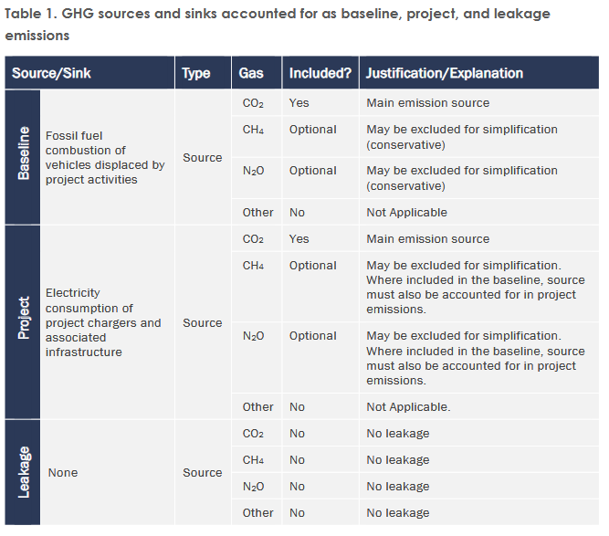

# Critique of Current Carbon Crediting Methodologies for EV Charging Infrastructure: A Case Study of Verra VM0038

***

# 减排量量化方法：**净减排量 = (基线排放 - 项目排放) × 折扣因子**

GitHub Markdown 支持使用 `$$` 来渲染 LaTeX 数学公式。以下为 VM0038 方法学中的核心计算公式：

### 1. 基线排放 (Baseline Emissions)

$$ BE_y = \sum_{i,f} \frac{ED_{i,y} \times EF_{i,f,y} \times 100 \times IR_i^{y-1}}{AFEC_{i,y} \times MPG_{i,y}} $$

### 2. 电动汽车加权平均电耗 (Weighted Average EV Electricity Consumption)

$$ AFEC_{i,y} = \frac{\sum_a (EV_{a,i,y} \times EVR_{a,i,y})}{\sum_a EVR_{a,i,y}} $$

### 3. 对标燃油车加权平均油耗 (Weighted Average Fossil Fuel MPG)

$$ MPG_{i,y} = \frac{\sum_a (MPG_{a,i,y} \times EVR_{a,i,y})}{\sum_a EVR_{a,i,y}} $$

### 4. 基础项目排放 (Basic Project Emissions)

$$ PE_y = \sum_{i,j} EC_{i,j,y} \times EF_{el,i,j,y} $$

### 5. 含配套基础设施的项目排放 (Project Emissions with Associated Infrastructure)

$$ PE_y = \sum_{i,j,s} NEC_{i,j,s,y} \times EF_{kwAI,i,j,s,y} - \sum_{i,j} LEC_{i,j,y} \times EF_{kwonsitebatt,i,j,y} $$

### 6. 现场储能电池排放因子 (On-site Battery Emission Factor)

$$ EF_{kwonsitebatt,i,j,y} = \frac{\sum_z (ECB_{i,j,s,y} \times EF_{kwAI,i,j,s,y})}{\sum_z ECB_{i,j,s,y}} $$

### 7. 最终净减排量 (Net GHG Emission Reductions)

$$ ER_y = (BE_y - PE_y) \times D_y $$

### 参数说明表：

- $i$：适用车队类别 (Applicable Fleet class)
- $j$：电力来源区域 (Region)
- $y$：项目核算年度 (Project Year)
- $s$：配套基础设施来源 (Associated Infrastructure Source，如电网、光伏、电池)
- $a$：特定的电动汽车车型 (EV Model)
- $f$：对应的化石燃料类型 (Fossil Fuel type)
- $BE_y$：第 $y$ 核算年度的**基准排放量**（单位：$tCO_2e$）
- $ED_{i,y}$：第 $y$ 核算年度，由项目充电系统向适用车队 $i$ **输送的电量**（单位：$kWh$）
- $EF_{i,f,y}$：第 $y$ 核算年度，对标车队 $i$ 所使用的化石燃料 $f$ 的**排放因子**（单位：$tCO_2e/gallon$）
- $IR_i$：适用车队 $i$ 的**技术改进率因子**（用于修正未来燃油车能效提升对基准线的影响）
- $AFEC_{i,y}$：第 $y$ 核算年度，适用车队 $i$ 中电动汽车的**加权平均单位里程电耗额定值**（单位：$kWh/100~miles$）
- $MPG_{i,y}$：第 $y$ 核算年度，与适用车队 $i$ 对标的化石燃料车辆的**加权平均燃油效率额定值**（单位：$miles/gallon$）
- $EV_{a,i,y}$：第 $y$ 核算年度，适用车队 $i$ 中车型 $a$ 的电动汽车**单位里程电耗额定值**（单位：$kWh/100~miles$）
- $MPG_{a,i,y}$：第 $y$ 核算年度，与适用车队 $i$ 中车型 $a$ 的电动汽车相对标的化石燃料车型的**燃油效率额定值**（单位：$miles/gallon$）
- $EVR_{a,i,y}$：截至第 $y$ 核算年度，适用车队 $i$ 中车型 $a$ 的电动汽车**累计保有量**（用于加权计算）
- $PE_y$：第 $y$ 核算年度的**项目排放量**（单位：$tCO_2e$）
- $EC_{i,j,y}$：第 $y$ 核算年度，区域 $j$ 内服务于适用车队 $i$ 的项目充电桩所**消耗的电量**（单位：$kWh/year$）
- $EF_{el,i,j,y}$：第 $y$ 核算年度，区域 $j$ 内服务于适用车队 $i$ 的项目充电系统所消耗电力的**排放因子**（单位：$tCO_2e/kWh$）
- $NEC_{i,j,s,y}$：第 $y$ 核算年度，区域 $j$ 内服务于适用车队 $i$ 的充电系统从配套基础设施来源 $s$ 消耗的**净电量**（已扣除回馈电量，单位：$kWh/year$）
- $EF_{kwAI,i,j,s,y}$：第 $y$ 核算年度，区域 $j$ 内服务于适用车队 $i$ 的充电系统从各配套基础设施来源 $s$ 消耗电力的**排放因子**（单位：$tCO_2e/kWh$）
- $LEC_{i,j,y}$：第 $y$ 核算年度，区域 $j$ 内服务于适用车队 $i$ 的现场储能电池向电网或建筑提供的电量（即未用于充电的**逃逸/转移电量**，单位：$kWh/year$）
- $EF_{kwonsitebatt,i,j,y}$：第 $y$ 核算年度，区域 $j$ 内服务于适用车队 $i$ 的充电系统从**现场储能电池**配套基础设施消耗电力的排放因子（单位：$tCO_2e/kWh$）
- $ECB_{i,j,s,y}$：第 $y$ 核算年度，区域 $j$ 内服务于适用车队 $i$ 的现场储能电池从配套基础设施来源 $s$（仅含电网及专用可再生能源）**消耗的电量**（单位：$kWh/year$）
- $ER_y$：第 $y$ 核算年度的**温室气体净减排量**（单位：$tCO_2e$）
- $D_y$：第 $y$ 核算年度适用的**折扣因子**（调减系数），用于校准权属并防止重复计算（单位：%）

***

## 1. 物理边界的缺失：从建材隐含碳到高频维保 

**A 阶段 (CapEx)**：充电桩制造（特别是大功率直流快充 DCFC 包含的大量铜、铝、电力电子模块）、土建施工、变压器等前端隐含碳被默认归零。

> 项目边界除了替代的燃油消耗外，只包含了运营期间充电基础设施的电力消耗。忽视充电桩的隐含碳会导致签发的 VCUs 被系统性高估。

**B 阶段 (Maintenance)** : 真实的物理损耗无法在碳账本中体现。

> 10-20年服役期内（尤其是易损耗的充电枪线、模块更换）的碳足迹未被纳入任何项目排放 (PE) 参数中

**C & D 阶段 (EoL & Circularity)**: 报废拆除的环境影响和材料回收的效益均不在 Table 1 的核算范围内。

## 2. 时间分辨率的缺陷：静态排放因子与智能电网的背离&#x20;

### 2.1 静态假设的荒谬性

在评估电网排放因子时，VM0038 暴露出在时间颗粒度上的粗放。根据 **Section 9.2** 对参数 *EFel*,*i*,*j*,*y* 的监测要求，该方法学依赖于**年度更新的、区域级**的静态数据（如美国的 eGRID）。

> **\[📝 你的任务 - 完善 2.1]**
>
> - 引用文档中 `Section 9.2` 要求“Annual”（年度）监测频率的规定。
> - 结合新西兰 (New Zealand) 的高比例可再生能源电网背景，举例说明静态因子的危害：例如，中午光伏大发时碳强度极低，傍晚负荷高峰时碳强度极高。年度平均值掩盖了这种日内剧烈波动。

### 2.2 削峰填谷激励的丧失与 dMRV 的必要性

采用年度静态 $EF$ 意味着，无论用户是在“零碳的太阳能中午”还是在“高碳的燃煤午夜”充电，获得的碳减排积分是相同的。
这不仅无法激励运营商进行电网友好的智能充电调度，甚至可能在晚高峰加剧化石燃料机组的调用，造成物理排放增加而账面依然签发减排量的“扭曲效应”。

> **\[📝 你的任务 - 完善 2.2]**
>
> - 用一段话强调：现代 EV 充电桩已具备 IoT 级别的高频计量能力。
> - （过渡句，埋下伏笔）VM0038 的静态逻辑严重滞后于现有的 IoT 基础设施能力，这凸显了引入动态边际排放因子 (Dynamic MEF) 进行高频动态 LCA (dLCA) 计算的迫切性。

***

## 3. 碳债务的掩盖与伦理漏洞 (The Ethical and Financial Loophole: Missing Carbon Payback Period)

### 3.1 收益前置化掩盖的真实负债

VM0038 允许项目在投运的首年即开始签发并变现碳信用，这掩盖了一个残酷的基础设施物理事实：任何充电站在投运初期，由于庞大的 CapEx 隐含碳，其全生命周期的净碳排放必然是负数（即处于巨大的“碳债务 Carbon Debt”状态）。

> **\[📝 你的任务 - 完善 3.1]**
>
> - 结合你的资产管理 (IAM) 背景，用严厉的学术口吻指出：在没有偿清初始碳债务之前，就向市场兜售所谓的“绿色碳信用”，在伦理和金融逻辑上都是站不住脚的。
> - （过渡句，埋下伏笔）这就要求未来的 MRV 架构必须引入“净正向临界点 (Net-Positive Tipping Point)”机制，只有累计运营减排真正覆盖了建站和维保债务后，才能打开铸币阀门。

***

## 4. 废弃负债的监管真空与系统性漂绿风险 (The EoL Liability Vacuum and Systemic Greenwashing Risks)

### 4.1 无人兜底的电子垃圾 (E-waste) 危机

通过检索全文，VM0038 没有任何关于设备寿命终结 (End-of-Life)、废弃物处理、电池回收或电子垃圾防治的环境约束条款。更甚者，在 **Section 8.3 (Leakage Emissions)** 中，原文直接断言：“泄漏在本方法学下不被视为问题，因此设定为零”。

> **\[📝 你的任务 - 完善 4.1]**
>
> - 引用 `Section 8.3` 的原文，证明其对 C 阶段 (报废拆除) 和 D 阶段 (回收) 的完全漠视。
> - 描述一个“收益前置化、负债外部化”的糟糕场景：运营商享受了 10 年的碳信用收益，第 11 年设备报废，富含重金属和难降解材料的硬件沦为无人处理的电子污染源。

### 4.2 政策合规性的脱节与碳准备金机制的呼唤

这种缺乏保证金机制 (Bond Mechanism) 和碳回撤 (Clawback) 机制的顶层设计，构成了典型的系统性“漂绿 (Greenwashing)”漏洞。这与当前日益严格的全球气候信息披露要求（如新西兰 XRB 强制气候披露、欧盟 CSRD）背道而驰，监管机构正越来越严厉地要求企业对 Scope 3 和资产报废承担责任。

> **\[📝 你的任务 - 完善 4.2]**
>
> - 结合新西兰 XRB 政策，总结这种传统方法学将面临越来越大的合规审查风险。
> - （过渡句，为引出你的终极武器做铺垫）为了从根本上消除这种漂绿风险，必须在机制设计层面引入强制性的“EoL 碳准备金池 (Carbon Escrow Vault)”，利用代币经济学提前锁定环境负债。

***

## 结论：向 WLC-dMRV 范式转移的必然性 (Conclusion: The Imperative Shift towards WLC-dMRV)

综合以上分析，以 VM0038 为代表的现行碳积分方法学在空间边界、时间分辨率、全生命周期资产管理逻辑以及防漂绿机制上存在深层的系统性缺陷。为了建立真正可信、可审计且符合未来监管合规要求的碳资产体系，从传统的“静态、片面、中心化”核算向\*\*“动态、全生命周期、去中心化”的 WLC-dMRV 架构\*\*转型，已成为基础设施碳资产管理的必然趋势。
