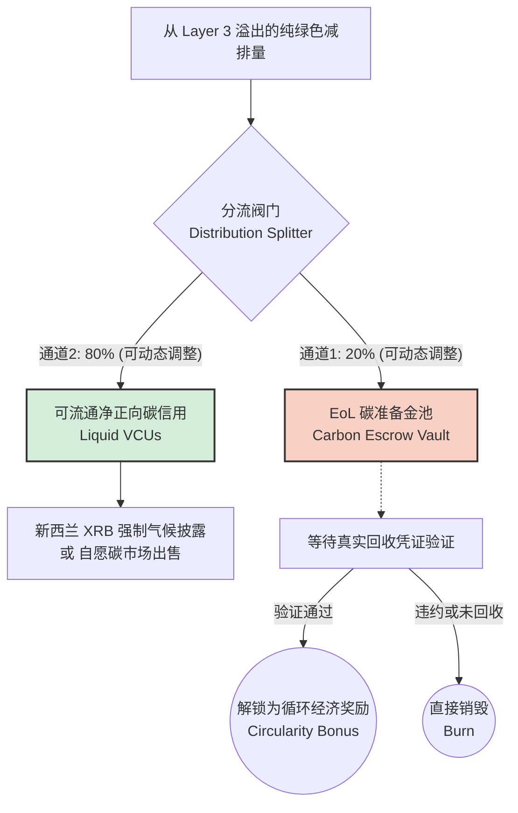
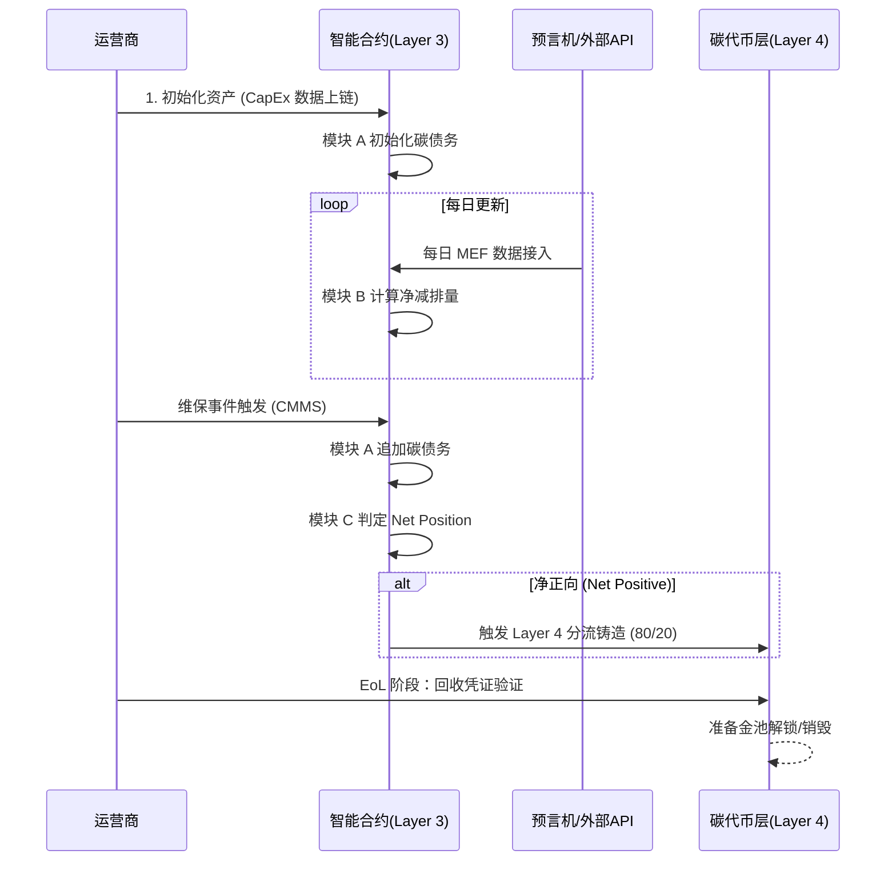

# 🌿 Thesis: WLC-dMRV

> **"A Blockchain-Based Trusted Whole-Life Carbon Assetization Architecture for EV Charging Infrastructure"**

[]()

---
## 📂 仓库文件概览 (Repository Structure)

```text
trusted_dmrv/
├── Literature_Review/                 # 文献综述与相关方法学分析
│   ├── Verra_VCS_EV_Charging_Methodology/ # Verra VM0038/VMD0049 等碳积分方法学草案及分析
│   ├── database search queries/       # 数据库检索式与引文导出文件 (CSV/RIS)
│   ├── Prisma_AB.md / PRISMA_AB.docx  # PRISMA 文献筛选流程记录
│   └── AB_matrix.pdf / 4.0_AB.xlsx    # 文献矩阵与对比分析表
├── Methodology/                       # 方法学与架构设计
│   ├── sample/                        # 参考样例与相关研究论文
│   └── 技术路线_WLC_dMRV.md            # WLC-dMRV 技术路线详细规划
└── README.md                          # 项目核心介绍与架构概览（本文档）
```

---

## 📑 Table of Contents

- [Background & Pain Points](#-研究背景与痛点)
- [Research Questions](#-研究问题-research-questions)
- [WLC-dMRV 4-Layer Architecture Design](#-wlc-dmrv-四层架构设计)
- [LCA Evaluation Model Construction](#-lca-评价模型构建)
- [System Prototype & Web Interface](#-系统原型开发与-web-界面)
- [Performance Testing & Case Study](#-性能测试与案例验证)
- [Thesis Chapter Structure](#-论文章节结构)
- [Summary of Innovations](#-核心创新点总结)

---

## 🔍 Background & Pain Points

- **Location**: New Zealand
- **Core Subject**: Electric Vehicle (EV) Charging Infrastructure

> [!WARNING]
> **Pain Point 1: Physical Boundary Gap**
> Current carbon credit methods for EV charging systems (like Verra VM0038) have incomplete physical boundaries. They mostly focus on the emission cuts from replacing gas cars during the operational phase (OpEx). However, they largely ignore the embodied carbon in the charging stations and hardware. Over a 15-20 year lifespan, many emissions are left out of the carbon accounting. These include the CapEx embodied carbon during construction, maintenance emissions (B2-B5), end-of-life teardown (C1-C4), and recycling benefits (D). Since the true cradle-to-grave carbon footprint is never fully tracked, the carbon credits issued today are systematically overvalued.

> [!WARNING]
> **Pain Point 2: Digital Trust Gap**
> Collecting, calculating, and reporting carbon data has long relied on centralized platforms. Different stakeholders—such as operators, grid companies, maintenance teams, and auditors—hold fragmented data. There is no single, tamper-proof, and independently verifiable "Single Source of Truth" across organizations. Carbon credits issued on this basis face "greenwashing" doubts. Emission reductions might be double-counted, environmental liabilities at the end-of-life stage are left unguaranteed, and the poor underlying data quality makes it hard to convince regulators and carbon market buyers.

---

## ❓ Research Questions

Based on these two pain points, this study asks two main research questions:

> [!IMPORTANT]
> **RQ1: Trust in the Lifecycle dMRV Data Loop**
> Can we combine blockchain, IoT, and dynamic LCA to build a cradle-to-grave carbon tracking loop for EV charging infrastructure? Compared to traditional centralized MRV, can this system provide stronger trust in three areas: data integrity, on-chain auditability, and cross-party verification?

> [!IMPORTANT]
> **RQ2: Anti-Greenwashing Mechanism Design**
> Can smart contracts automate the logic chain: setting up initial carbon debt, accumulating net reductions, and deciding carbon payoffs? Furthermore, can we use a distribution splitter and a Carbon Escrow Vault to lock in end-of-life (EoL) environmental liabilities upfront? Ultimately, does this mechanism design effectively reduce the greenwashing risk of carbon credits?

---

## 🏗️ WLC-dMRV 四层架构设计

### Layer 1：物理资产与数据层 (Physical Asset & Data Layer)
**定位**：真实世界的投影，dMRV 中"MR"（监测与报告）的物理基础。

| 数据源 | 内容 | 对应 LCA 阶段 |
| :--- | :--- | :--- |
| **充电站隐含碳数据** | 建站材料（钢材、混凝土、铜线缆等）+ 充电设备（充电桩、变压器、配电柜等）+ 施工安装 | A1-A5（CapEx / Balance of System） |
| **智能电表** | 实时高频充电数据 (kWh) | B6（OpEx / 转换与待机损耗） |
| **CMMS 系统** | 资产物理维保事件触发 | B2-B5（维修换件） |
| **EoL 回收凭证** | 报废期真实回收记录 | C1-C4 / D（E-waste / 循环经济） |

### Layer 2：预言机与整合层 (Oracle & Integration Layer)
**定位**：可信桥梁，防篡改地将链下数据传输上链。

| 数据类型 | 数据源 | 传输方式 |
| :--- | :--- | :--- |
| **静态数据** | 上游制造商/供应商提供的产品碳足迹声明、国家级 EPD 数据库（如 BRANZ 等） | 去中心化预言机（如 Chainlink）上链 |
| **动态数据** | 新西兰 Transpower 实时边缘电网碳强度 MEF (gCO₂/kWh)，B2-B5阶段的维保事件 | API → 预言机 → 智能合约 |

### Layer 3：动态 LCA 与智能合约引擎层 (dLCA & Smart Contract Engine)

**模块 A：碳债务账本 (Carbon Debt Ledger)**
```typescript
// Input: CapEx 隐含碳数据 + CMMS 维保换件信号

function initCarbonDebt(assetId, CapEx_embodied_carbon, BRANZ_EPD_data) {
    // ① 验证用户身份 (ClientIdentity)
    // ② 检查资产是否已初始化（防重复）
    // ③ 调用 Layer 2 预言机获取 BRANZ EPD 数据
    // ④ 计算初始碳债务 = CapEx 材料量 × EPD 排放因子
    // ⑤ 初始化红色负资产余额 (debt_balance = - carbon_debt)
    // ⑥ 存入区块链状态数据库
}

function appendCarbonDebt(assetId, CMMS_event) {
    // ① Oracle 验证 CMMS 事件真实性
    // ② 调用 EPD 数据计算替换件的隐含碳
    // ③ 追加到 debt_balance（负资产增加）
    // ④ emit 事件通知模块 C
}
```

**模块 B：动态运营 LCA 引擎 (Dynamic Operational LCA Engine)**
```typescript
// Input: 智能电表高频充电数据 + Transpower MEF 实时电网碳强度

function calculateDailyNetReduction(assetId, charging_kWh, MEF) {
    // ① Oracle 获取 Transpower MEF（gCO₂/kWh）实时数据
    // ② 计算实际充电碳排放 = charging_kWh × MEF
    // ③ 获取燃油基准线排放 = charging_kWh × ICE_benchmark_factor
    // ④ 计算每日净减排量 = 基准线排放 - 实际充电碳排放
    // ⑤ 累计净减排量 += 每日净减排量
    // ⑥ 更新状态，触发模块 C 的净正向判定
}
```

**模块 C：净正向触发器 (Net-Positive Tipping Point)**
```typescript
function checkNetPositive(assetId) {
    // ① 读取模块 B 的累计净减排量 (cumulative_reduction)
    // ② 读取模块 A 的累计碳债务 (cumulative_debt)
    // ③ 判定: net_position = cumulative_reduction + cumulative_debt

    if (net_position > 0) {
        // ④ 计算溢出量 = net_position
        // ⑤ 调用 Layer 4 的分流阀门合约
        // ⑥ Emit: "Carbon Net-Positive Achieved" 事件
    } else {
        // ⑦ 记录状态: "Still in Carbon Debt"
    }
}
```

### Layer 4：代币经济学与资产管理层 (Tokenomics & Asset Management Layer)

> [!NOTE]
> **定位**：质押机制设计，解决传统碳信用的"漂绿"和"废弃阶段环境负债无人担保"问题。



---

## 📊 LCA 评价模型构建

### 遵循标准
严格遵循 **ISO 14040** 与 **ISO 14044** 国际标准。

### 功能单位
**1 kWh 的 EV 充电服务**，或一个充电站全生命周期（如 20 年）。

### 系统边界
**全生命周期 (Cradle-to-Cradle / Cradle-to-Grave)** —— 这是相比现有研究（通常仅 Cradle-to-Gate）的显著进步：

| LCA 阶段 | 内容 |
| :--- | :--- |
| **A1-A3** | 建材生产（钢材、混凝土、铜线缆、充电桩设备等） |
| **A4-A5** | 运输与施工安装 |
| **B2-B5** | 维保替换（充电枪头、电缆、电力电子模块等） |
| **B6** | 运营电网能耗（动态 MEF 实时接入） |
| **C1-C4** | 报废拆除 |
| **D** | 回收与循环经济奖励 |

### 影响类别
全球变暖潜能 (GWP)，单位：$\text{kg-CO}_{2\text{eq}}$。

### LCI 方法：动态混合 LCA (Dynamic Hybrid LCA)
相比传统静态混合 LCA，"动态"体现在 MEF 实时电网碳强度因子的每日变化（新西兰水电/火电比例波动导致电网碳强度波动）。

### 核心公式体系

**1. CapEx 隐含碳（初始碳债务）：**
$$ E_{\text{embodied}} = \sum_{i} Q_i \times EF_i^{\text{EPD}} $$
其中：
- $Q_i$ 为第 $i$ 种材料用量
- $EF_i^{\text{EPD}}$ 为相应材料的 BRANZ EPD 排放因子

**2. OpEx 动态运营碳排放：**
$$ E_{\text{op}}(t) = \sum_{d=1}^{t} \text{kWh}_d \times \text{MEF}_d $$
其中：
- $\text{kWh}_d$ 为第 $d$ 天的充电量
- $\text{MEF}_d$ 为 Transpower 当日边缘电网碳强度

**3. 净减排量（核心评价指标）：**
$$ \text{Net Reduction}(t) = \sum_{d=1}^{t} \text{kWh}_d \times (EF_{\text{ICE}} - \text{MEF}_d) $$
其中：
- $EF_{\text{ICE}}$ 为同里程燃油车排放基准线因子

**4. 碳偿付判定（"净正向触发点"判定）：**
$$ \text{Carbon Balance}(t) = \text{Net Reduction}(t) - E_{\text{embodied}} - E_{\text{maintenance}}(t) $$
当 $\text{Carbon Balance}(t) > 0$ 时，触发 Layer 4 的"铸币阀门"，绿色减排量溢出至代币经济层。

---

## 💻 系统原型开发与 Web 界面

### 利益相关方与功能界面

| 利益相关方 | 功能界面 |
| :--- | :--- |
| **充电站运营商** | 初始化资产（录入 CapEx 数据）、查看碳债务余额、查看每日净减排进度 |
| **维保团队** | CMMS 事件上报接口、替换件隐含碳自动计算 |
| **电网数据提供方**| Transpower MEF 数据预言机接入状态监控 |
| **碳信用买方 / 审计方** | 查看净正向碳信用生成记录、EoL 碳准备金池余额、可流通 VCUs 数量 |
| **回收方** | EoL 回收凭证上传、触发准备金池解锁 |

### 系统整体流程



---

## 🔬 性能测试与案例验证

### A. 区块链性能测试 (Benchmark)

| 测试维度 | 方案 |
| :--- | :--- |
| **工具** | Hyperledger Caliper（Fabric）/ Hardhat Gas Reporter（Ethereum L2） |
| **TPS 测试** | 模拟新西兰全国 500-1000 个充电站每日并发数据写入压力 |
| **Worker 测试** | 模拟多利益相关方同时操作（充电站、维保、审计方） |
| **交易量测试** | 模拟 10 年全生命周期累计交易量 |
| **核心指标** | Create（碳债务初始化 / 每日 LCA 写入）的 TPS 和延迟；Query（碳信用余额查询）的响应时间 |

### B. 新西兰案例验证 (Case Study)

选取新西兰真实 EV 充电网络（如 ChargeNet NZ 的站点或 WEL Networks 的充电走廊），输入真实数据：

- **CapEx 隐含碳**：站点建材清单 + BRANZ EPD
- **OpEx 充电量**：过去 12 个月的实际充电 kWh
- **电网碳强度**：Transpower MEF API 日均值
- **维保事件**：CMMS 记录的实际换件（如充电枪头、电力电子模块更换）

**输出结果**：每日/每阶段碳排放和累计净减排量的实时追踪记录表，以及"碳偿付回正时间线"图。


---

## 📚 论文章节结构

| 章节 | 标题 | 核心内容 |
| :--- | :--- | :--- |
| **1** | **Introduction** | 研究背景、双重痛点、2 个 Research Questions、WLC-dMRV 概述 |
| **2** | **Literature Review**| 2.1 EV 充电基础设施 LCA 研究现状 → 2.2 区块链在碳追踪应用 → 2.3 充电设施应用 → 2.4 研究空白 |
| **3** | **Methodology** | 3.1 四层架构设计 → 3.2 智能合约引擎 → 3.3 动态 LCA 模型 → 3.4 代币经济学分流机制 |
| **4** | **Results** | 4.1 原型 Web 界面 → 4.2 区块链性能测试 → 4.3 新西兰案例验证 → 4.4 创新性对比分析 |
| **5** | **Discussion** | RQ1 验证 (三维可信基础) → RQ2 验证 (防漂绿机制有效性) → 动态 vs 静态 LCA → 局限性与未来工作 |
| **6** | **Conclusion** | 总结贡献 + 政策启示（新西兰 XRB 强制气候披露）+ 对自愿碳市场的意义 |

---

## 🌟 Summary of Innovations

1. **Full Lifecycle Boundary**: The system boundary is expanded from "cradle-to-gate" to "cradle-to-cradle". Most importantly, the Layer 4 Carbon Escrow Vault brings the end-of-life (EoL) recycling phase into the carbon asset loop for the first time.
2. **Dynamic Grid Carbon Factor**: Instead of using a fixed annual average, the system uses the Transpower MEF API and oracles to fetch real-time grid carbon data every day.
3. **3-Module Smart Contract Engine**: This engine includes a Carbon Debt Ledger, a Dynamic Operational LCA, and a Net-Positive Trigger. Together, they fully automate carbon tracking and payoff decisions.
4. **Anti-Greenwashing Tokenomics**: The architecture features a distribution splitter, a mandatory EoL Carbon Escrow Vault, and real recycling certificate verification. This ensures the carbon credits are solid and free of "greenwashing". *(Note: The escrow split ratio, such as 80/20, is illustrative and should be calibrated dynamically based on empirical lifecycle data of the specific charging infrastructure.)*
5. **Tailored Local Databases**: Designed for New Zealand, the system integrates BRANZ EPD and Transpower MEF databases. This makes asset management much more accurate and reliable for local projects.
